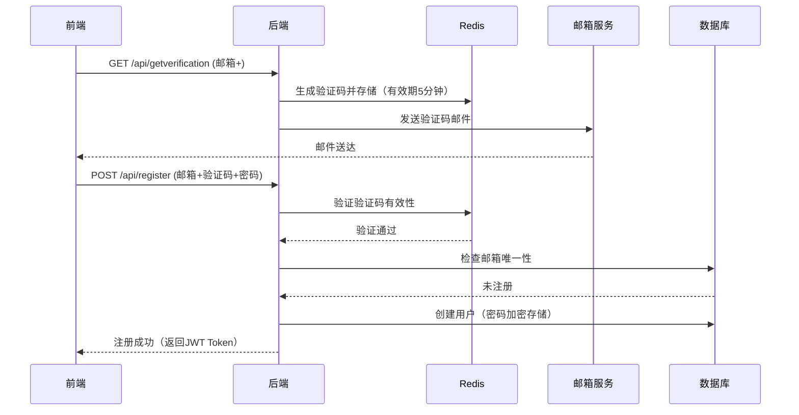

## 账号服务

### 注册

注意！仅有患者需要注册账号，医生和管理员账号由管理员手动导入

- 要求用户输入账号，账号就是邮箱
- 要求用户输入密码，密码要求大于等于8个字符，且要含有字母
- 要求用户再次输入密码，如果两次密码不一致则提醒
- 上述操作结束后可以点击发送验证码（有效时间五分钟）
- 点击以后要求输入邮箱验证码
- 点击注册按钮
- 注册成功后要有提示

### 登录

- 各个端的请求需要携带登录身份信息（患者？医生？管理员？）
- 